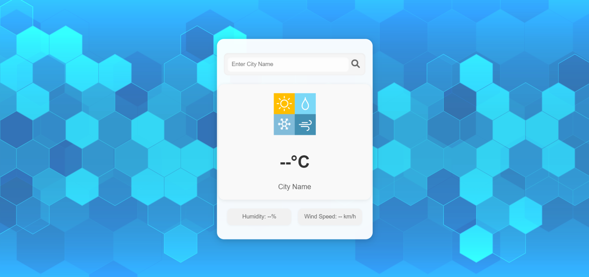

# Weather-App-3

A simple, responsive Weather App built with HTML, CSS and JavaScript. It fetches and displays current weather information for a given city using a public weather API and presents it with a clean, easy-to-read UI.

## Screenshot

## Features

- Search weather by city name
- Displays temperature, weather description, humidity, and wind speed
- Clean and responsive design that works on desktop and mobile
- Built with plain HTML, CSS and vanilla JavaScript (no frameworks)

## Demo / Usage

1. Clone the repository:

   git clone https://github.com/BinaryVortex/Weather-App-3.git

2. Open `index.html` in your browser (double-click or serve with a simple http server):

   - Using Python 3: `python -m http.server 8000` and visit `http://localhost:8000`

3. Type a city name into the search input and press Enter or click the search button to fetch weather data.

## Files of interest

- `index.html` — Main HTML page
- `style.css` — App styles
- `script.js` — JavaScript logic that calls the weather API and updates the UI
- `weather-forecast.png`, `a.jpg` — additional images/assets

## Technologies

- HTML
- CSS
- JavaScript (Fetch API)

## Contribution

Contributions are welcome. If you'd like to improve the app (add features, fix bugs, or improve accessibility), please open an issue or submit a pull request.

## Notes

- If the app uses an external weather API that requires an API key, make sure to add instructions to set the key (either directly in `script.js` for local testing or via a safe environment mechanism). If you want, I can update the README with exact API/key setup instructions — tell me which API/key method you're using.

## Author

BinaryVortex

## License

This project does not include a LICENSE file. Add one (for example MIT) if you want to make the license explicit.
